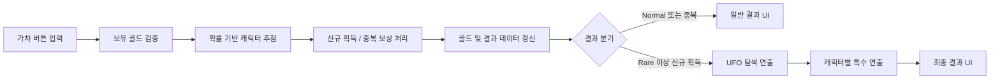

# MINIverse Gacha UI & Presentation

Unity 기반 미니게임 프로젝트 **MINIverse**에서 담당한 가챠 시스템, 결과 UI, 캐릭터 등장 연출을 정리한 포트폴리오용 저장소입니다.

> 이 저장소는 전체 프로젝트가 아니라, 제가 담당한 가챠 UI/연출 관련 스크립트와 실행 결과만 공개한 코드 아카이브입니다.  
> 원본 프로젝트의 공통 시스템, 리소스, 세이브 데이터 구조 일부는 제외되어 있어 단독 실행용 Unity 프로젝트는 아닙니다.

## Preview

### Dragon

### Nine Tail

### Unicorn

## 담당 범위

- 일반/특수 뽑기 비용 차감 및 확률 기반 캐릭터 추첨
- 신규 획득 / 중복 보상 처리 및 보유 골드 갱신
- 결과 등급에 따른 일반 결과 화면 / 특수 연출 화면 분기
- DOTween 기반 UI 전환, UFO 탐색, 캐릭터 등장 애니메이션 구현
- ParticleSystem을 활용한 캐릭터별 결과 피드백 연출
- Shader Property를 활용한 디졸브 기반 캐릭터 등장 연출
- 연속 입력 방지, Tween 종료, Particle 초기화 등 반복 실행 안정성 처리

## Tech Stack

- Unity / C#
- UGUI / TextMeshPro
- DOTween
- ParticleSystem
- Shader Property Control

## 주요 구현 흐름

## 대표 구현 코드

| 파일 | 구현 내용 |
|---|---|
| `Scripts/GachaButtonManager.cs` | 가챠 버튼 입력, 골드 검증, 신규/중복 보상 처리, 결과 화면 분기 |
| `Scripts/GachaRoller.cs` | 캐릭터 등급별 가중치 기반 추첨 로직 |
| `Scripts/UFOScopeIntro.cs` | Shader 중심 좌표를 갱신하는 UFO 탐색 연출, 힌트 아웃라인 적용 |
| `Scripts/UFOButtonEffect.cs` | UFO 클릭 입력 잠금, DOTween 이동 연출, 결과 캐릭터별 Particle 분기 |
| `Scripts/CharacterAppear.cs` | 캐릭터 등장 Scale 애니메이션, Particle 초기화 및 재생 |
| `Scripts/ResultCanvasManager.cs` | 결과 카드 이미지와 보유 골드 갱신, 결과별 Particle 출력 |
| `Scripts/DragonSpecialIntro.cs` | Shader Property 기반 디졸브 연출과 전용 등장 시퀀스 |
| `Scripts/NineTailSpecialIntro.cs` | 구미호 전용 등장 연출 시퀀스 |
| `Scripts/UnicornSpecialIntro.cs` | 유니콘 전용 등장 연출 시퀀스 |

## 구현 포인트

### 1. 확률 추첨과 결과 분기

`GachaRoller`에서 등급별 가중치를 기반으로 캐릭터를 추첨하고, `GachaButtonManager`에서 결과가 Normal인지, 중복인지, Rare 이상 신규 획득인지에 따라 화면 흐름을 분기했습니다.

이 구조를 통해 결과 데이터와 UI 연출을 분리하고, 캐릭터가 추가되어도 추첨 로직과 결과 연출 흐름을 유지할 수 있도록 구성했습니다.

### 2. 사용자 피드백 중심의 UI 연출

가챠 결과가 바로 노출되지 않도록 UFO 탐색, 클릭, 파티클, 캐릭터 등장 순서로 시퀀스를 구성했습니다.

DOTween을 활용해 화면 전환과 오브젝트 움직임을 제어하고, 캐릭터 타입에 따라 전용 Particle과 결과 화면이 출력되도록 분기했습니다.

### 3. 반복 실행 안정성

가챠는 반복 실행이 많은 기능이기 때문에 연출이 끝난 뒤에도 이전 Tween, Particle, CanvasGroup 상태가 남지 않도록 초기화 처리를 넣었습니다.

`DOKill`, `StopEmittingAndClear`, Canvas 활성화/비활성화 처리를 통해 다시 뽑기를 실행해도 이전 결과가 섞이지 않도록 관리했습니다.

### 4. Shader 기반 시각 효과

특수 캐릭터 등장 시 `Shader Property` 값을 DOTween으로 제어하여 디졸브 연출을 적용했습니다.

연출 자체보다 결과 등급과 캐릭터 등장 순간을 명확하게 전달하는 데 초점을 두었습니다.

## Repository Scope

이 저장소에는 포트폴리오 검토를 위해 공개 가능한 가챠 UI/연출 스크립트와 GIF만 포함했습니다.

다음 항목은 원본 프로젝트의 공통 시스템 또는 외부 리소스에 해당하여 포함하지 않았습니다.

- `CharacterData`
- `CharacterManager`
- `SaveManager`
- `SoundManager`
- `RarityConfig`
- 원본 아트 리소스 및 전체 Unity 프로젝트 설정

## Rights

Portfolio viewing only. No license is granted for reuse or redistribution of the source code or media in this repository.
