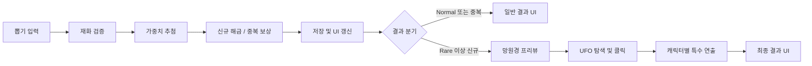

# MINIverse Gacha UI & Presentation

Unity 기반 미니게임 프로젝트 **MINIverse**에서 담당한 캐릭터 가챠 UI와 2D 연출 구현을 정리한 포트폴리오 저장소입니다.

> 이 저장소는 팀 프로젝트 전체 소스가 아닌, 본인이 담당한 가챠 씬 스크립트와 실행 결과만 선별한 포트폴리오용 코드 아카이브입니다. 전체 프로젝트 의존성이 제외되어 있어 단독 실행용 Unity 프로젝트는 아닙니다.

## 담당 범위

- 일반/특수 뽑기와 재화 검증
- 희귀도별 가중치 추첨
- 신규 캐릭터 해금 및 중복 보상 처리
- 저장 데이터와 재화 UI 연동
- 망원경·UFO 탐색 인터랙션
- 캐릭터 타입별 파티클·배경·결과 화면 분기
- 다시 뽑기와 로비 복귀 흐름
- DOTween 기반 UI 시퀀스 및 상태 초기화

## Tech Stack

- Unity / C#
- uGUI / TextMeshPro
- DOTween
- Particle System
- UI Shader parameter control

## 실행 결과

### Goni

### Miho

### Uni

## 사용자 흐름

## 주요 구현

### 희귀도 확률을 보존하는 추첨

`GachaRoller`는 `CharacterManager`에서 가챠 획득 대상으로 설정된 캐릭터를 구성하고, 희귀도 가중치를 같은 등급의 캐릭터 수로 나누어 정규화합니다. 캐릭터가 추가되더라도 희귀도 전체 확률이 의도치 않게 증가하지 않도록 누적 가중치 방식으로 결과를 선택합니다.

### 결과 데이터와 연출의 연결

`GachaButtonManager`가 재화 검증, 추첨, 신규/중복 처리, 저장과 결과 분기를 조정합니다. 일반 결과와 중복 결과는 기본 결과 화면으로, Rare 이상 신규 결과는 망원경·UFO 특수 시퀀스로 연결합니다.

### 카메라 이동 없는 2D 탐색 연출

`GachaTelescopePreview`와 `UFOScopeIntro`는 UI 위치·회전·스케일·알파 트윈과 셰이더의 중심점·반경 값을 조합합니다. 실제 카메라를 이동하지 않고 망원경이 UFO를 추적하고 놓친 뒤 다시 발견하는 흐름을 구성했습니다.

### 인터랙션과 캐릭터별 분기

`UFOButtonEffect`는 중복 입력을 막고 클릭 시 스쿼시 앤 스트레치, 이동, 회전, 페이드 연출을 실행합니다. 추첨된 캐릭터 타입에 따라 파티클과 전용 결과 화면을 선택하고, 파티클 재생 시간이 끝난 뒤 다음 시퀀스로 전환합니다.

### 캐릭터 공개 시퀀스

캐릭터별 인트로는 디졸브 값을 제어해 심볼을 제거하고, 상·하단 배경을 열면서 캐릭터를 `0.05 → 1.18 → 1.0` 스케일로 등장시킵니다. 등장 완료 후 캐릭터별 파티클을 재생합니다.

### 반복 실행 안정화

다시 뽑기와 화면 재진입 시 Tween과 파티클을 종료·초기화하고, UI Transform과 CanvasGroup 상태를 복원합니다. 연출 중에는 버튼 입력을 잠가 시퀀스 중복 실행을 방지합니다.

## Script Map

| 영역 | 스크립트 |
|---|---|
| 추첨 및 화면 분기 | `GachaButtonManager`, `GachaRoller` |
| 메인 화면 연출 | `GachaMachineAnimation`, `GachaTelescopePreview` |
| UFO 탐색/입력 | `UFOScopeIntro`, `UFOButtonEffect` |
| 캐릭터 공개 | `BackgroundMove`, `CharacterAppear` |
| 캐릭터별 인트로 | `DragonSpecialIntro`, `NineTailSpecialIntro`, `UnicornSpecialIntro` |
| 결과 화면 | `ResultCanvasManager`, `ResultIntro` |

## Repository Scope

공개 범위를 본인 담당 작업으로 제한하기 위해 팀 공용 시스템, 다른 미니게임 코드, 원본 아트 리소스와 프로젝트 설정은 포함하지 않았습니다. 스크립트가 참조하는 `CharacterData`, `CharacterManager`, `SaveManager`, `SoundManager`, `RarityConfig` 등은 전체 프로젝트의 공용 시스템입니다.

## Rights

Portfolio viewing only. No license is granted for reuse or redistribution of the source code or media in this repository.
